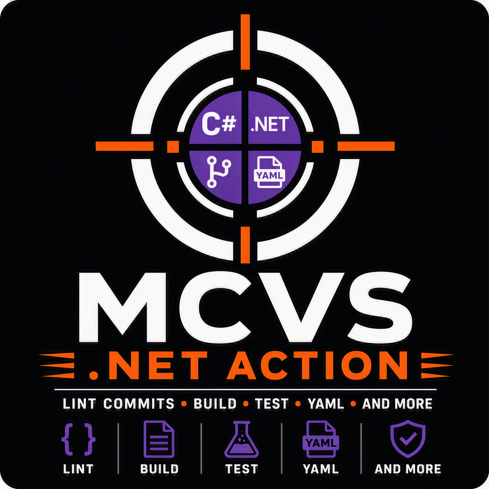

# MCVS Dotnet Action

[](https://github.com/schubergphilis/mcvs-dotnet-action/releases)
[](LICENSE)

</a>


The Mission Critical Vulnerability Scanner (MCVS) Dotnet Action repository is a
collection of standardized tools to ensure a certain level of quality of a
project with .NET code.

It is the .NET counterpart of the
[mcvs-golang-action](https://github.com/schubergphilis/mcvs-golang-action) and
the [mcvs-php-action](https://github.com/schubergphilis/mcvs-php-action) and
follows the same structure: a composite GitHub Action and a remote Taskfile
that are used both in CI and locally.

## Github Action

The [GitHub Action](https://github.com/features/actions) in this repository
consists of the following steps:

- Install the .NET SDK version that is defined in the project `global.json` or,
  when that file is absent, the version that matches the `TargetFramework` of
  the projects.
- Verify that every project restores and that the `packages.lock.json` files
  are in sync with the project files.
- Verify the restored NuGet packages.
- Code security scanning and suppression of certain CVEs for a maximum of one
  month. In some situations a particular CVE will be resolved in a couple of
  weeks and this allows the developer to continue in a safe way while knowing
  that the pipeline will fail again if the issue has not been resolved in a
  couple of weeks.
- Linting, using `dotnet format whitespace` and `dotnet format style`.
- Static analysis, using the Roslyn analysers, both as build warnings that are
  treated as errors and via `dotnet format analyzers`.
- Unit tests.
- Integration tests, using Testcontainers.
- Component tests, using Testcontainers.
- End-to-end tests.
- Code coverage.
- Mutation testing, using Stryker.NET.
- A test summary, including the name of every test that has been run for the
  testing type at hand, using the detailed console logger.

In summary, using this action will ensure that .NET code meets certain
standards before it will be deployed to production as the assembly line will
fail if an issue arises.

Note: there is an [internal action](.github/workflows/package-version-updater.yml)
that will update package versions that cannot be updated by Dependabot.

## Versioning

This action follows semantic versioning. When using this action in your workflows:

- **Latest stable version**: Use the latest `v1.x.x` tag for production workflows
- **Major version tracking**: Use `@v1` to automatically get the latest v1.x.x updates
- **Taskfile references**: When including the remote Taskfile, use a specific version tag that matches your needs
- **Breaking changes**: Major version bumps (v1 → v2) may introduce breaking changes and require workflow updates

Check the [releases page](https://github.com/schubergphilis/mcvs-dotnet-action/releases) for the latest version and changelog.

## Taskfile

Another tool is configuration for [Task](https://taskfile.dev/). This repository
offers a `./build/task.yml` which contains standard tasks, like installing and
running a linter.

This `./build/task.yml` can then be used by other projects. This has the
advantage that you do not need to copy and paste Makefile snippets from one
project to another. As a consequence each project using this `./build/task.yml`
immediately benefits from improvements made here (e.g. new tasks or
improvements in the tasks).

If you are new to Task, you may want to check out the following resources:

- [Installation instructions](https://taskfile.dev/installation/)
- Instructions to [configure completions](https://taskfile.dev/installation/#setup-completions)
- [Integrations](https://taskfile.dev/integrations/) with e.g. Visual Studio Code, Sublime and IntelliJ.

### Tooling

Most of the tooling is part of the .NET SDK itself and is therefore neither
pinned nor installed by this action. The tools that are not, are pinned in
`./build/task.yml` and are installed in `~/.mcvs-dotnet-action/bin`, unless the
`MCVS_DOTNET_ACTION_BIN` environment variable points somewhere else. No global
.NET tool installation is modified.

| Tool                                                                                                         | Purpose                            |
| :----------------------------------------------------------------------------------------------------------- | :--------------------------------- |
| [dotnet format](https://learn.microsoft.com/en-us/dotnet/core/tools/dotnet-format)                           | Formatting and coding standard     |
| [Roslyn analysers](https://learn.microsoft.com/en-us/dotnet/fundamentals/code-analysis/overview)             | Static analysis and mess detection |
| [dotnet test](https://learn.microsoft.com/en-us/dotnet/core/tools/dotnet-test)                               | Testing                            |
| [coverlet](https://github.com/coverlet-coverage/coverlet)                                                    | Collecting code coverage           |
| [ReportGenerator](https://github.com/danielpalme/ReportGenerator)                                            | Merging and reporting the coverage |
| [dotnet publish](https://learn.microsoft.com/en-us/dotnet/core/tools/dotnet-publish)                         | Compiling a single file binary     |
| [dotnet list package](https://learn.microsoft.com/en-us/dotnet/core/tools/dotnet-list-package)               | Vulnerability scanning             |
| [osv-scanner](https://github.com/google/osv-scanner)                                                         | Vulnerability scanning             |
| [Stryker.NET](https://github.com/stryker-mutator/stryker-net)                                                | Mutation testing                   |
| [Testcontainers](https://github.com/testcontainers/testcontainers-dotnet)                                    | Containers for the tests           |
| [MSBuild](https://learn.microsoft.com/en-us/visualstudio/msbuild/msbuild)                                    | Building non SDK style projects    |

Some notes:

- **coverlet** is not installed by this action. The test projects have to
  reference the `coverlet.collector` package, as that package implements the
  `XPlat Code Coverage` data collector that the `coverage` task uses. The
  `dotnet new xunit` template references it out of the box.
- **ReportGenerator** and **Stryker.NET** are installed as pinned .NET tools,
  as they are not part of the SDK.
- **Testcontainers** is not installed either: it is a NuGet package that the
  test projects reference themselves. This action only verifies that a
  container runtime is reachable before it runs the integration, component and
  end-to-end tests and warns about the networks that have been left behind, see
  the [Testcontainers](#testcontainers) paragraph.
- **MSBuild** is only used when the `build-tool` input is set to `msbuild`, see
  the [MSBuild](#msbuild) paragraph. The .NET SDK ships an MSBuild of its own,
  so the default `dotnet` build tool covers every SDK style project.

### Configuration

The `./build/task.yml` in this project defines a number of variables. Some of
these can be overridden when including this Taskfile in your project. See the
example below, where the `CODE_COVERAGE_STRICT` variable is overridden, for how
to do this.

The following variables can be overridden:

<!-- markdownlint-disable MD013 -->

| Variable                     | Description                                                                                              |
| :--------------------------- | :------------------------------------------------------------------------------------------------------- |
| `CODE_COVERAGE_STRICT`       | Enables or disables strict enforcement of setting the minimum coverage to the maximum observed coverage. |
| `DOTNET_BUILD_CONFIGURATION` | The configuration that is built and tested. Default: `Release`.                                          |
| `DOTNET_BUILD_TOOL`          | The tool that builds and restores: `dotnet` or `msbuild`. Default: `dotnet`.                             |
| `DOTNET_SOLUTION`            | The solution or project that the tasks are run against. Default: the solution that has been found.       |
| `DOTNET_VERBOSITY`           | The verbosity of the dotnet commands. Default: `minimal`.                                                |
| `MSBUILD_ARGS`               | Arguments that are passed to every build, restore, test and publish command. Default: empty.             |
| `MUTATION_TIMEOUT`           | The duration before the mutation testing times out. Default: `20m`.                                      |
| `RELEASE_SELF_CONTAINED`     | Whether the published binary contains the .NET runtime. Default: `true`.                                 |
| `STRYKER_CONFIG_PATH`        | The path to the optional Stryker.NET configuration. Default: `stryker-config.json`.                      |
| `STRYKER_OUTPUT_DIR`         | The directory that the mutation report is written to. Default: `build/mutation`.                         |
| `TESTCONTAINERS_RYUK_DISABLED` | Whether the Testcontainers resource reaper is disabled. Default: `false`.                              |
| `TEST_FILTER_COMPONENT`      | The `dotnet test --filter` expression of the component tests. Default: `Category=Component`.              |
| `TEST_FILTER_E2E`            | The `dotnet test --filter` expression of the end-to-end tests. Default: `Category=E2E`.                   |
| `TEST_FILTER_INTEGRATION`    | The `dotnet test --filter` expression of the integration tests. Default: `Category=Integration`.          |
| `TEST_FILTER_UNIT`           | The `dotnet test --filter` expression of the unit tests. Default: every test without a category.          |

<!-- markdownlint-enable MD013 -->

## Usage

### Locally

Create a `Taskfile.yml` with the following content:

```yml
---
version: 3

vars:
  REMOTE_URL: https://raw.githubusercontent.com
  REMOTE_URL_REF: v1.0.0
  REMOTE_URL_REPO: schubergphilis/mcvs-dotnet-action

includes:
  remote: >-
    {{.REMOTE_URL}}/{{.REMOTE_URL_REPO}}/{{.REMOTE_URL_REF}}/build/task.yml
```

and run:

```zsh
TASK_X_REMOTE_TASKFILES=1 \
task remote:test
```

Note that the `TASK_X_REMOTE_TASKFILES` variable is required as long as the
remote Taskfiles are still experimental. (See [issue
1317](https://github.com/go-task/task/issues/1317) for more information.)

You can use `task --list-all` to get a list of all available tasks.
Alternatively, if you have [configured
completions](https://taskfile.dev/installation/#setup-completions) in your
shell, you can tab to get a list of available tasks.

The most frequently used tasks:

```zsh
# Required: enable experimental remote taskfiles support
export TASK_X_REMOTE_TASKFILES=1

# Restore the nuget dependencies
task remote:restore --yes

# Run unit tests
task remote:test --yes

# Run integration tests
task remote:test-integration --yes

# Run component tests
task remote:test-component --yes

# Run linting
task remote:lint --yes

# Run static analysis
task remote:static-analysis --yes

# Run code coverage
task remote:coverage --yes

# Run mutation tests
task remote:mutation --yes

# Run security scanning
task remote:nuget-audit --yes
task remote:osv-scanner --yes

# Automatically fix linting issues
task remote:fix-linting-issues --yes
```

### Automatically Fixing Linting Issues

When the linters report issues that can be automatically fixed, you can use the
`fix-linting-issues` task:

```zsh
TASK_X_REMOTE_TASKFILES=1 \
task remote:fix-linting-issues --yes
```

This task runs `dotnet format`, which fixes the whitespace, code style and
analyser issues that can be resolved automatically, based on the rules and
severities of the `.editorconfig`.

After running this task, review the changes and commit them. Note that some
linting issues may still require manual fixes.

If you want to override one of the variables in our Taskfile, you will have to
adjust the `includes` sections like this:

```yml
---
includes:
  remote:
    taskfile: >-
      {{.REMOTE_URL}}/{{.REMOTE_URL_REPO}}/{{.REMOTE_URL_REF}}/build/task.yml
    vars:
      CODE_COVERAGE_STRICT: "false"
```

## Test categories

.NET has no equivalent of the Go build tags. The testing type is therefore
mapped onto a test category, which is a
[trait](https://learn.microsoft.com/en-us/dotnet/core/testing/selective-unit-tests)
that `dotnet test --filter` selects on. Annotate the tests as follows:

```csharp
[Trait("Category", "Integration")] // xUnit
[Category("Integration")]          // NUnit
[TestCategory("Integration")]      // MSTest
```

The following categories are recognized:

- **`Integration`**: For integration tests that require external services or databases
- **`Component`**: For component tests that test multiple units working together
- **`E2E`**: For end-to-end tests that test the entire application flow
- Every test **without** one of the categories above is a unit test and is run
  by the `unit` testing type

The filter of each testing type can be overridden through the
`TEST_FILTER_COMPONENT`, `TEST_FILTER_E2E`, `TEST_FILTER_INTEGRATION` and
`TEST_FILTER_UNIT` variables, e.g. to select on a project name convention
instead of on a category. Note that NUnit and MSTest expose the category as
`TestCategory` rather than as `Category`.

The `test-filter` input is combined with the filter of the testing type and can
be used to narrow a run down further, e.g.
`test-filter: FullyQualifiedName~Slow`.

### GitHub

#### Basic Example

For a simple project that needs standard testing and linting, create a
`.github/workflows/dotnet.yml` file:

```yml
---
name: dotnet
"on": pull_request
permissions:
  contents: read
  packages: read
jobs:
  mcvs-dotnet-action:
    strategy:
      matrix:
        args:
          - testing-type: "unit"
          - testing-type: "lint"
          - testing-type: "static-analysis"
          - testing-type: "coverage"
          - testing-type: "security-nuget-packages"
    runs-on: ubuntu-24.04
    env:
      TASK_X_REMOTE_TASKFILES: 1
    steps:
      - uses: actions/checkout@v4.2.2
      - uses: schubergphilis/mcvs-dotnet-action@v1
        with:
          testing-type: ${{ matrix.args.testing-type }}
          token: ${{ secrets.GITHUB_TOKEN }}
```

This basic configuration will run unit tests, linting, static analysis, code
coverage checks and security scanning on your .NET code.

#### Advanced Example

For projects with integration tests or custom requirements, create a
`.github/workflows/dotnet.yml` file with the following content:

```yml
---
name: dotnet
"on": pull_request
permissions:
  contents: read
  packages: read
jobs:
  mcvs-dotnet-action:
    strategy:
      matrix:
        args:
          - testing-type: "component"
          - testing-type: "coverage"
          - testing-type: "e2e"
          - testing-type: "integration"
          - testing-type: "lint"
          - testing-type: "mutation"
          - testing-type: "nuget-validate"
          - testing-type: "security-grype"
          - testing-type: "security-nuget-packages"
          - testing-type: "static-analysis"
          - testing-type: "unit"
    runs-on: ubuntu-24.04
    env:
      TASK_X_REMOTE_TASKFILES: 1
      test-timeout: 10m
    steps:
      - uses: actions/checkout@v4.2.2
      - uses: schubergphilis/mcvs-dotnet-action@v1.0.0
        with:
          code-coverage-expected: "84.2"
          code-coverage-timeout: ${{ env.test-timeout }}
          mutation-score-expected: "70"
          task-install: yes
          test-timeout: ${{ env.test-timeout }}
          testing-type: ${{ matrix.args.testing-type }}
          token: ${{ secrets.GITHUB_TOKEN }}
```

and an [.editorconfig](.editorconfig) and a
[Directory.Build.props](Directory.Build.props).

<!-- markdownlint-disable MD013 -->

| Option                                              | Default | Required | Description                                                                                     |
| :-------------------------------------------------- | :------ | -------- | :---------------------------------------------------------------------------------------------- |
| build-tool                                          | x       |          | The tool that builds and restores: `dotnet` or `msbuild`                                        |
| code-coverage-expected                              | x       |          | Minimum expected code coverage percentage                                                       |
| code-coverage-timeout                               |         |          | Timeout duration for code coverage analysis (e.g., "10m")                                       |
| dotnet-version                                      |         |          | The .NET SDK version to install. Overrules the version that is derived from the version file    |
| dotnet-version-file                                 | x       |          | The global.json from which the .NET SDK version is derived                                      |
| github-token-for-downloading-private-nuget-packages |         |          | GitHub token with permissions to download NuGet packages from the GitHub Packages registry      |
| grype-version                                       |         |          | Specific version of Grype vulnerability scanner to use                                          |
| msbuild-args                                        |         |          | Additional arguments for every build, restore, test and publish command                         |
| msbuild-install                                     | x       |          | Whether MSBuild is added to the PATH, which requires a Windows runner                           |
| mutation-score-expected                             | x       |          | Minimum expected mutation score that Stryker.NET has to report                                  |
| mutation-timeout                                    |         |          | Timeout duration for the mutation testing (e.g., "30m")                                         |
| release-application-name                            |         |          | Name of the application to build (required when release-dir is set)                             |
| release-configuration                               | x       |          | The configuration that is used to publish the application                                       |
| release-dir                                         |         |          | Directory that contains the project of the binary to build                                      |
| release-project                                     |         |          | The project file that has to be published, when the release-dir contains more than one          |
| release-runtime                                     | x       |          | The .NET runtime identifier (RID) to publish for, e.g. linux-x64                                |
| release-type                                        | x       |          | Type of release to build (e.g., "binary")                                                       |
| restore-args                                        |         |          | Additional arguments that are passed to `dotnet restore`, e.g. `--ignore-failed-sources`        |
| task-install                                        | x       |          | Whether to install Task runner ("yes" or "no")                                                  |
| task-version                                        | x       |          | Version of Task runner to install                                                               |
| test-filter                                         |         |          | An additional `dotnet test --filter` expression                                                 |
| test-timeout                                        |         |          | Timeout duration for test execution (e.g., "10m")                                               |
| testcontainers-ryuk-disabled                        | x       |          | Whether the Testcontainers resource reaper, Ryuk, is disabled                                   |
| testing-type                                        |         |          | Type of testing to run (e.g., "unit", "integration", "lint", "coverage", "mutation", "security-nuget-packages") |
| token                                               |         |          | GitHub token for authentication (typically ${{ secrets.GITHUB_TOKEN }})                         |

Note: If an **x** is registered in the Default column, refer to the
[action.yml](action.yml) for the corresponding value.

<!-- markdownlint-enable MD013 -->

### Releases

In some cases, you may want a binary to be built and released automatically.
This action will publish a self contained single file binary with
[dotnet publish](https://learn.microsoft.com/en-us/dotnet/core/tools/dotnet-publish),
which could then be used as a release asset.

Create a `.github/workflows/dotnet-releases.yml` file with the following
content:

```yml
---
name: dotnet-releases
"on": push
permissions:
  contents: write
  packages: read
jobs:
  mcvs-dotnet-action:
    strategy:
      matrix:
        args:
          - release-application-name: some-app
            release-dir: src/SomeApp
            release-runtime: linux-x64
          - release-application-name: some-app
            release-dir: src/SomeApp
            release-runtime: linux-arm64
    runs-on: ubuntu-24.04
    env:
      TASK_X_REMOTE_TASKFILES: 1
    steps:
      - uses: actions/checkout@v4.2.2
      - uses: schubergphilis/mcvs-dotnet-action@v1.0.0
        with:
          release-application-name: ${{ matrix.args.release-application-name }}
          release-dir: ${{ matrix.args.release-dir }}
          release-runtime: ${{ matrix.args.release-runtime }}
          release-type: binary
          token: ${{ secrets.GITHUB_TOKEN }}
```

The `release-application-name` is passed as the `AssemblyName`, which makes the
location of the published binary deterministic. The asset that is attached to
the release is named
`<release-application-name>-<tag>-<release-runtime>`.

### Integration

To execute integration tests, annotate them with the `Integration` category, as
described in the [Test categories](#test-categories) paragraph.

After adding the test, issue the command `task remote:test-integration --yes`
as demonstrated in this example. If `task remote:test --yes` is executed, only
unit tests will be run.

### Component

See the integration paragraph for the steps and replace `Integration` with
`Component` to run them.

### Mutation testing

The `mutation` testing type runs [Stryker.NET](https://github.com/stryker-mutator/stryker-net),
which changes ("mutates") the source code and verifies that a test fails for
every change. A surviving mutant is a line that is covered by a test, but of
which the behaviour is not asserted, so it complements the code coverage
rather than duplicating it.

```zsh
TASK_X_REMOTE_TASKFILES=1 \
task remote:mutation --yes
```

The run fails when the mutation score is below the `mutation-score-expected`
input, which is passed to Stryker as its break, low and high threshold, so that
the expected score is defined in one place. The report is written to
`build/mutation/reports/mutation-report.html` and lists every surviving mutant.
Use `task remote:mutation-visual --yes` to open it.

A `stryker-config.json` is optional and is only passed to Stryker when it
exists, see [stryker-config.json.example](stryker-config.json.example). Note
that mutation testing is considerably slower than a normal test run, as the
test suite is run once per mutant. Therefore the `mutation-timeout` input
defaults to a higher value than the `test-timeout` input and it is advisable to
narrow the run down with the `mutate` option of the configuration file.

### Testcontainers

The integration, component and end-to-end tests are expected to create their
dependencies, such as a database or a message broker, with
[Testcontainers](https://github.com/testcontainers/testcontainers-dotnet).
Add the `Testcontainers` package to the test project and annotate the tests
with the category of the testing type at hand:

```csharp
[Fact]
[Trait("Category", "Integration")]
public async Task TheRepositoryStoresTheOrder()
{
    await using var postgres = new PostgreSqlBuilder().Build();
    await postgres.StartAsync();
    // ...
}
```

Before those testing types run, the action verifies that a container runtime is
reachable and fails with an actionable message when it is not, as the failure
of Testcontainers itself is hard to interpret. After the local
`test-integration` and `test-component` tasks it also reports the Docker
networks that have been left behind, which is usually a container that is not
disposed by the test.

The `testcontainers-ryuk-disabled` input is passed to the tests as the
`TESTCONTAINERS_RYUK_DISABLED` environment variable. Disabling Ryuk, the
resource reaper of Testcontainers, is only sensible on an ephemeral runner, as
the containers of a failed run are then left behind. Every other Testcontainers
environment variable, such as `DOCKER_HOST`, is passed through by the runner
and is therefore configured in the workflow itself.

### MSBuild

Every task uses the `dotnet` CLI by default, which covers the SDK style
projects. Projects that the SDK cannot drive on its own, such as the .NET
Framework and the C++/CLI ones, need MSBuild:

```yml
- uses: schubergphilis/mcvs-dotnet-action@v1
  with:
    build-tool: msbuild
    msbuild-install: yes
    testing-type: ${{ matrix.args.testing-type }}
    token: ${{ secrets.GITHUB_TOKEN }}
```

The `build-tool: msbuild` input makes the build run
`msbuild -restore -maxCpuCount` and the restore run `msbuild -t:Restore`, in
which the lock file verification is expressed as `-p:RestoreLockedMode=true`.
The `msbuild-install: yes` input adds the MSBuild of the Visual Studio
installation to the PATH and therefore requires a Windows runner, e.g.
`runs-on: windows-2022`.

Regardless of the build tool, the `msbuild-args` input is passed to every
build, restore, test and publish command, which is the way to hand over
properties:

```yml
with:
  msbuild-args: -p:ContinuousIntegrationBuild=true -p:Platform="Any CPU"
```

### Security scanning

The `security-nuget-packages` testing type runs both
`dotnet list package --vulnerable` and `osv-scanner` against the
`packages.lock.json` files. Therefore the `RestorePackagesWithLockFile`
property has to be enabled and the resulting lock files have to be committed,
also for a library. See [docs/osv-scanner.md](docs/osv-scanner.md) for the way
to temporarily suppress a CVE.

### Self testing

This repository runs every testing type against the [example](example)
solution, a small library plus its test project, through `uses: ./` in
[.github/workflows/dotnet.yml](.github/workflows/dotnet.yml). It doubles as a
worked example of the conventions that this action expects: the test
categories, a committed `packages.lock.json`, the reference `.editorconfig` and
`Directory.Build.props`, and the way to resolve a vulnerability in a transitive
dependency by pinning the patched version directly.

### Differences with the mcvs-php-action

- **Mess detection and automated refactoring**: PHPMD and Rector have no
  standalone .NET equivalent, as the Roslyn analysers cover both the code
  quality rules and the automated fixes. They are therefore part of the
  `static-analysis` testing type instead of separate testing types.
- **Mutation testing**: the `mutation` testing type, which runs Stryker.NET,
  has no counterpart in the PHP action.
- **composer-validate**: replaced by `nuget-validate`, which verifies that the
  `packages.lock.json` files are in sync with the project files, by restoring
  with `--locked-mode`.
- **Testsuites**: replaced by test categories, see the
  [Test categories](#test-categories) paragraph.
- **Releases**: an OS and architecture specific binary is published instead of
  a PHAR, so a `release-runtime` input exists instead of a `release-box-config`
  input.
