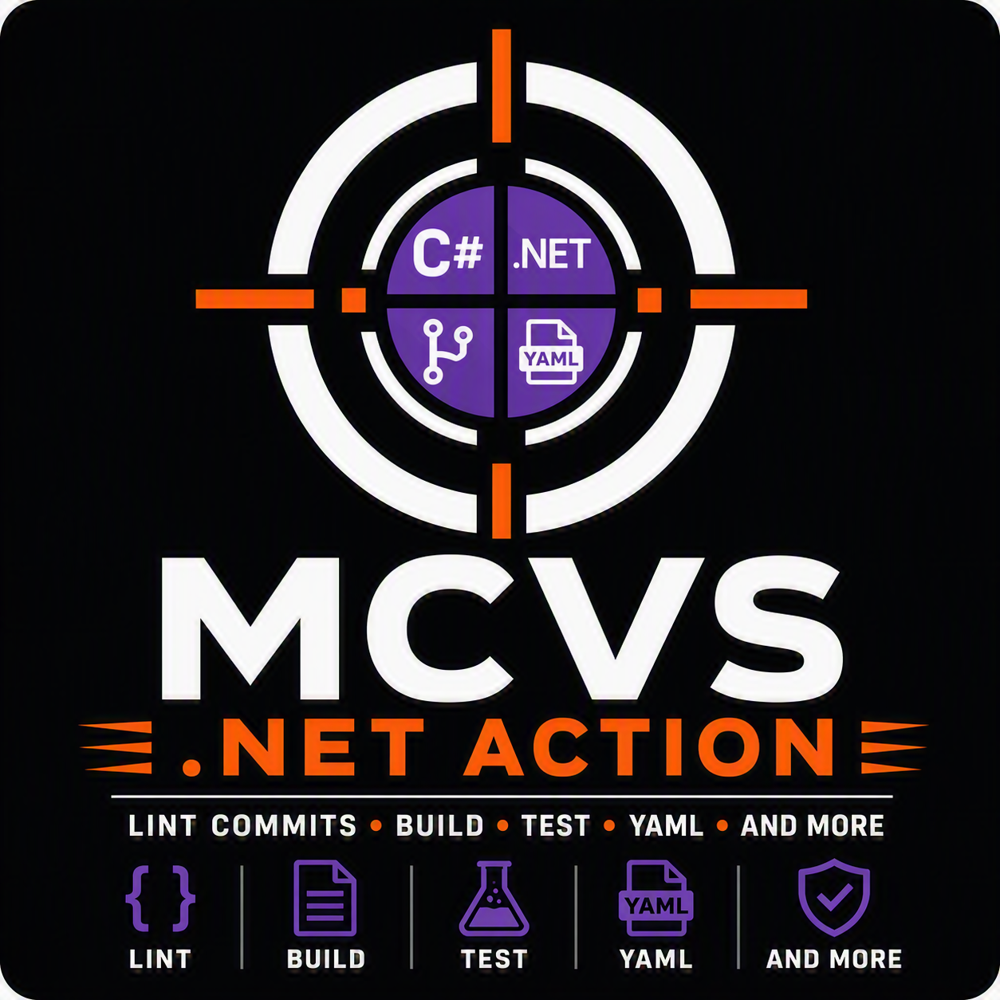

# MCVS .NET Action

Mission Critical Vulnerability Scanner (MCVS) .NET Action. Create .NET code without high and critical vulnerabilities.

## Quickstart

The action is under construction: there is no `action.yml` yet, so it cannot be
used in a workflow. The usage will be documented here once it lands. The
following steps already apply and prepare a .NET repository for it:

1. Copy [Directory.Build.props](Directory.Build.props) to the root of the
   repository. It enables `RestorePackagesWithLockFile`, which makes
   `dotnet restore` write a `packages.lock.json` for every project.
1. Run `dotnet restore` and commit the generated `packages.lock.json` files, as
   the vulnerability scanners audit the resolved versions in them.
1. Optionally, copy [osv-scanner.toml.example](osv-scanner.toml.example) to
   `osv-scanner.toml` to ignore a vulnerability that cannot be fixed right away.

## Documentation

- [osv-scanner](docs/osv-scanner.md): how the lock files are scanned and how to
  ignore a vulnerability
